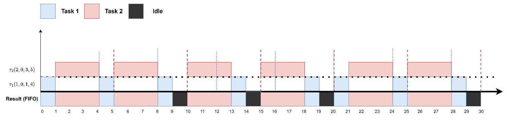
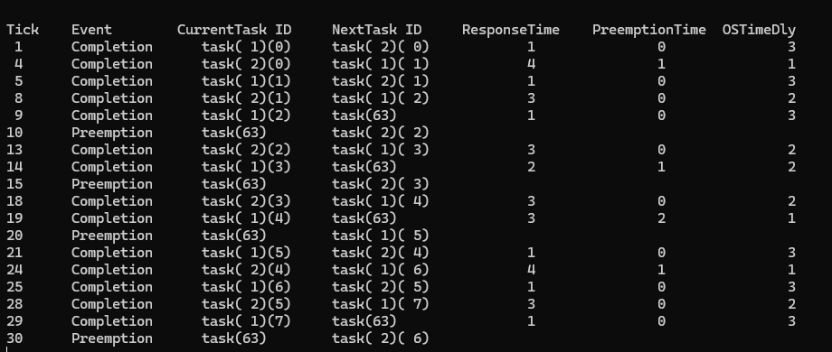
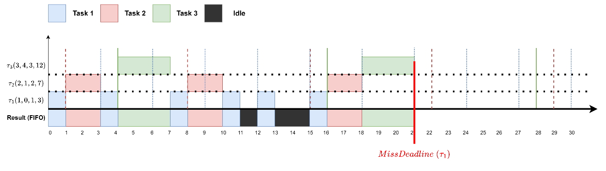
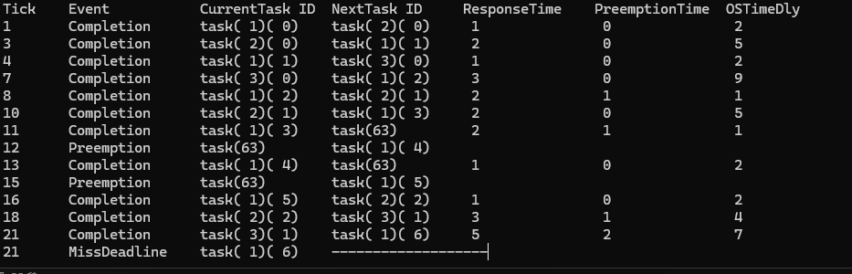
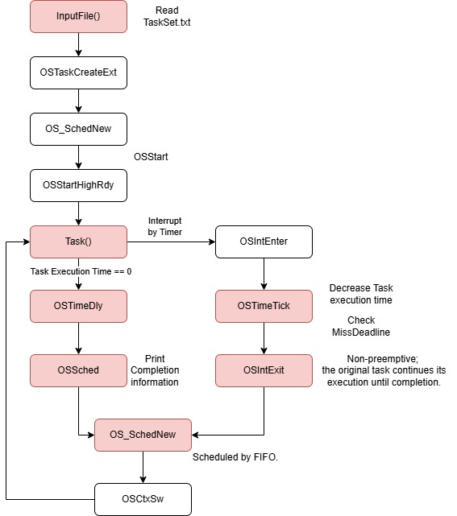

# RTOS  FIFO Scheduling
## Objective
To implement the non-preemptive First In First Out (FIFO) scheduling for periodic tasks, and handle the miss deadline behaviors.
## Problem Definition
Implement the following task set of periodic tasks. Add necessary code to the uC/OS-II scheduler in the kernel level to observe how the task suffers the schedule delay.
## example task set
| Task ID | Arrive Time | Execution Time | Task Period |
| :---: | :---: | :---: | :---: |
| 1 | 0 | 1 | 4 |
| 2 | 0 | 3 | 5 |

### output format
| Tick | Event | CurrentTask ID | NextTask ID |Response Time | Preemption Time | OSTimeDly |
| :---: | :---: | :---: | :---: | :---: | :---: | :---: |
| ## | Preemption | task(ID)(job number) | task(ID)(job number) |  |  |  |
| ## | Completion | task(ID)(job number) | task(ID)(job number) | ## | ## | ## |
| ## | MissDeadline | task(ID)(job number) | ---------- |  |  |  |
### Event Description
1. Response Time: the duration between the task's arrival time and the time it is completed.
2. Preemption Time: the time this task is preempted by higher-priority tasks.
3. OSTimeDly: the remaining delay time for this task
## Result
### The results of Task Set 1:

### The results of Task Set 2:

## Flow Chart

In accordance with the flowchart provided below, modifications were made to the kernel source code to implement the FIFO scheduling algorithm.